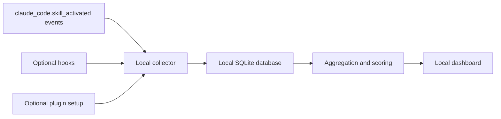

# Skill Health Dashboard

_A local-first open source dashboard for understanding and improving agent skill usage._

---

## Overview

Skill Health Dashboard helps individual users inspect how their local skills are used, identify low-value or overlapping skills, and make better decisions about which skills to keep, merge, split, or retire.

The project is designed around one core principle: skill usage data should stay local by default. It is intended to run on the user's machine, store data locally, and provide a dashboard that makes skill health understandable without requiring a cloud account or team analytics platform.

The statistical core is platform-agnostic: Skill Health works with local skill activation signals and local history importers. `claude_code.skill_activated` is one preferred source, and `import codex` is the currently built-in importer. Optional plugin integration can help with installation and collection setup, while hooks can enrich the picture by capturing toolchain behavior after a skill is activated.

## Project status

The MVP vertical slice is runnable. The Python CLI can initialize local storage, scan installed skills, optionally import local history (Codex importer included), aggregate events, run diagnostics, and start the dashboard. The Overview page and `/api/overview` are implemented now; Skill Table and Skill Detail are planned next.

## Documentation

| Document | Purpose |
| --- | --- |
| [MVP PRD](docs/prd.md) | Product scope, pages, user journeys, success criteria, and acceptance checklist |
| [Architecture](docs/architecture.md) | Local collection, storage, aggregation, scoring, and dashboard architecture |
| [Data definitions](docs/data-definitions.md) | Tables, fields, metric definitions, scoring rules, and time windows |
| [Installation and usage](docs/install-and-usage.md) | Local setup, sample data, dashboard usage, and troubleshooting |
| [Privacy and local data](docs/privacy.md) | What is collected, what is not collected, local storage, deletion, and hook boundaries |
| [Roadmap](docs/roadmap.md) | Phase 1 MVP, Phase 2 insights, Phase 3 optional assistance |
| [Changelog](CHANGELOG.md) | Release notes and documentation changes |

## What it does

Skill Health Dashboard is meant to answer practical questions such as:

- Which skills have actually been used in the last 30 days?
- Which skills have not been activated recently?
- Which skills are frequently triggered but appear to produce little downstream activity?
- Which skills may be too broad, too heavy, or overlapping with others?
- Which skills are candidates to merge, split, rewrite, or retire?

The goal is not to produce a perfect judgment about every skill. The goal is to give users enough local evidence to clean up and maintain their skill pool with confidence.

Skill Health Dashboard is a local-first dashboard for understanding your installed agent skills and their local usage history. It scans installed `SKILL.md` files, optionally imports local session history from supported agent platforms, and computes transparent health signals without uploading data.

## Quick start

```bash
python -m pip install -e .
skillcheck init
skillcheck refresh
skillcheck dashboard
```

`skillcheck` is the primary CLI command. The older `skill-health` command remains as a compatibility alias for now.

`skillcheck refresh` runs `scan skills`, `import codex`, `aggregate`, and `doctor` in sequence.

If you prefer terminal-only output (no dashboard page), run:

```bash
skillcheck summary
```

For structured output:

```bash
skillcheck summary --format json
```

`summary` now defaults to full-skill output and includes action hints about cleanup/replacement decisions.
Use `--all` when you want to explicitly request full output in scripts.

If you only want demo data:

```bash
skillcheck demo load
skillcheck dashboard
```

If you want to remove demo rows and switch to real local data:

```bash
skillcheck demo clear
skillcheck scan skills
skillcheck import codex
skillcheck aggregate
```

The `skillcheck dashboard` command rebuilds aggregates before serving.

## Detailed usage guide

Use this if you want a practical "I just installed it, now what?" flow.

1. Install and initialize local storage:

```bash
python -m pip install -e .
skillcheck init
```

2. Refresh local data and run diagnostics in one command:

```bash
skillcheck refresh
```

3. Read result directly in terminal (no browser needed):

```bash
skillcheck summary
skillcheck summary --format json
```

4. Open dashboard when you want visual cards and tables:

```bash
skillcheck dashboard
```

5. Understand status interpretation:

- `Qualified`: healthy skill with enough evidence and no serious risk flags.
- `Watch`: medium score or low confidence; monitor and refine.
- `Unqualified`: low score or explicit high-risk/security signals; review first.

Typical maintenance loop:

- Run `skillcheck refresh` daily or weekly.
- Check `skillcheck summary --format json` for automation/reporting.
- Remove or rewrite skills that stay `Unqualified` for multiple cycles.
- Use `skillcheck doctor` when opening GitHub issues.

## CI for contributors

This repository includes GitHub Actions CI at `.github/workflows/ci.yml`.

- Triggers on `push` to `main`, `pull_request` to `main`, and manual run.
- Runs `pytest` on Python `3.11`, `3.12`, and `3.13`.
- Installs with `python -m pip install -e ".[dev]"`.

To run the same checks locally:

```bash
python -m pip install -e ".[dev]"
pytest -q
```

## Target users

Skill Health Dashboard is built for:

- Individual developers using Claude Code or agent skills
- Advanced users maintaining a personal set of skills
- Users who want to improve skill organization and trigger precision
- People who prefer local, inspectable tools over hosted analytics

It is not intended to be:

- A cloud SaaS product
- A team management dashboard
- A cross-user analytics platform
- A remote telemetry collector
- A single standalone skill

## Core features

The MVP focuses on a small set of local-first capabilities:

| Area | MVP capability |
| --- | --- |
| Skill inventory | Scan real installed `SKILL.md` files into `skill_inventory` |
| Local import | Optionally import local usage proxies via importer commands (current: `skillcheck import codex`) |
| Local collection | Capture local skill activation events and related execution context |
| Local storage | Store raw and aggregated data in a local database |
| Overview | Show total skills, status cards/counts, top skills, and the sample-data banner |
| Health scoring | Apply transparent rules to classify skill health |
| Diagnostics | Surface candidates to review, merge, split, rewrite, or retire |
| Documentation | Explain installation, privacy, data model, and roadmap clearly |

Skill Table and Skill Detail are planned for the next slice after the Overview experience is stabilized.

## Dashboard metrics (V2)

The core dashboard metrics are:

| Metric | Meaning |
| --- | --- |
| `activation_count` | Number of skill activation events in the selected time window |
| `unique_sessions` | Number of distinct sessions where the skill appeared |
| `last_seen` | Most recent observed activation time |
| `avg_tool_depth` | Average amount of downstream tool activity after activation |
| `failure_proxy_rate` | Approximate rate of unsuccessful or low-value activation outcomes |
| `v2_health_score` | Weighted six-dimension score (0-100) |
| `v2_status` | `Qualified`, `Watch`, or `Unqualified` |
| `security_score` | Safety posture from risk-pattern checks |
| `clarity_score` | Boundary clarity from skill description signals |
| `overlap_score` | Redundancy risk score from local similarity analysis |
| `stability_score` | Cross-session consistency score |
| `efficiency_score` | Toolchain cost-efficiency proxy score |
| `confidence_score` | Evidence strength; low confidence weakens conclusions |

These metrics are intended to be understandable and inspectable. Early versions should prefer simple rules over opaque automated judgment.

## Health statuses (V2)

Skill Health Dashboard now uses confidence-aware categories:

| Status | Meaning |
| --- | --- |
| `Qualified` | High overall score, adequate evidence, and no critical risk flags |
| `Watch` | Medium score or evidence is still insufficient for a hard conclusion |
| `Unqualified` | Low score or explicit high-risk/security signals |

These labels are recommendations for human review, not automatic decisions. The tool should help users make informed edits, not rewrite or delete skills on their behalf.

## Local-first privacy model

By default, Skill Health Dashboard should:

- Store data locally
- Work without a remote server
- Avoid requiring user accounts
- Avoid uploading skill usage data
- Avoid storing prompt or response full text
- Make the collection scope visible to the user
- Allow users to delete local data

Importer scope in this MVP:

- Only extracts skill name/id, skill path, timestamp, session id, and local raw reference
- Stores `raw_event_ref` as local file path plus line number for debugging
- Uses local `SKILL.md` file loads as a conservative proxy until direct platform events are available

The product should be useful even when fully offline after installation.

## MVP scope

The first version should include:

- Local event collection
- Local database initialization
- Raw event storage
- Aggregated daily and 30-day statistics
- Overview page
- Rule-based health scoring
- Status classification
- Example data
- Installation documentation
- Privacy documentation

The current runnable MVP includes the Overview page and `/api/overview`; Skill Table and Skill Detail remain planned.

## Out of scope

The MVP will not include:

- Cloud accounts
- Multi-user aggregation
- Remote synchronization
- Automatic skill rewriting
- Automatic pull request creation
- Complex AI diagnostic agents
- Enterprise administration features

## Product assumptions

The project starts from these assumptions:

- Users are willing to install a local tool to optimize their skills
- Users care more about which skills are worth keeping than about complex analytics
- A local dashboard is acceptable even if it is not embedded in the agent UI
- Rule-based diagnostics are good enough for an MVP
- Privacy and local inspectability are core reasons users would adopt the tool

## Suggested architecture



The plugin layer is best used for installation and collection setup. Hooks are best used to supplement the official activation event with downstream toolchain behavior after a skill has been triggered.

python -m pip install -e .
skill-health init
skill-health refresh
skill-health summary
skill-health summary --format json
skill-health dashboard
## Roadmap

| Phase | Focus |
| --- | --- |
| Phase 1 | Local collection, SQLite storage, three dashboard pages, basic health rules |
| Phase 2 | Similarity detection, richer trends, report export |
| Phase 3 | Optional intelligent review assistance, rewrite suggestions, split suggestions |

## License

Skill Health Dashboard is released under the [MIT License](LICENSE).
