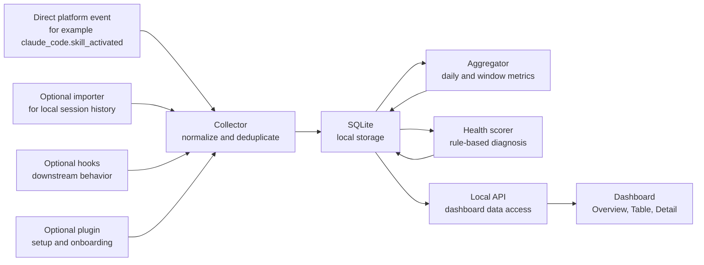
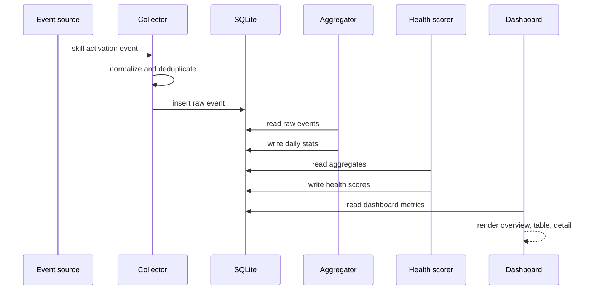

# Skill Health Dashboard Architecture

_System architecture for the local-first Skill Health Dashboard MVP._

---

## Purpose

This document describes the intended MVP architecture for Skill Health Dashboard. It explains how local skill activation events move from collection into storage, aggregation, scoring, and dashboard views.

The architecture is intentionally small. The first release should prove local usefulness before adding advanced diagnostics or automation.

## Architecture goals

- Support multiple local event/history sources across agent platforms
- Keep all default data storage local
- Make collection, aggregation, scoring, and display separable
- Keep health scoring transparent and reproducible
- Allow optional plugin and hook integration without making them mandatory
- Avoid cloud services, accounts, and remote synchronization in the MVP

## High-level system

## Components

### Collector

The collector ingests local skill activation events and optional enrichment signals.

Responsibilities:

- Read direct platform activation events when available
- Read normalized importer output from local history sources
- Normalize skill identifiers and timestamps
- Deduplicate repeated event ingestion
- Store raw observations in `skill_activation_events`
- Attach optional downstream metadata when available
- Avoid storing sensitive payloads by default

The collector should not decide whether a skill is healthy. It only records normalized local facts.

### Optional plugin layer

The plugin layer is appropriate for setup and onboarding.

Responsibilities:

- Help users install or configure collection
- Show what event source will be used
- Surface local configuration
- Reduce setup friction

The plugin layer should not become the statistical core. The product should still be understandable as a local dashboard built around transparent local activation signals.

### Optional hooks

Hooks can enrich the activation event with downstream behavior.

Responsibilities:

- Count tool activity after skill activation
- Capture lightweight failure proxy signals
- Provide bounded timing or follow-up metadata
- Avoid storing tool inputs, outputs, prompts, source code, or secrets

Hooks are optional because the dashboard should still work with activation events alone.

### Local storage

SQLite is the recommended MVP storage layer.

Responsibilities:

- Store raw activation events
- Store daily aggregates
- Store health score snapshots
- Keep sample data separate or visibly labeled
- Support local deletion and regeneration of derived tables

Primary tables:

- `skill_activation_events`
- `skill_daily_stats`
- `skill_health_scores`

The full schema contract lives in [data-definitions.md](data-definitions.md).

### Aggregator

The aggregator turns raw events into time-windowed metrics.

Responsibilities:

- Build daily per-skill statistics
- Calculate 7-day, 30-day, and 90-day summaries
- Compute `activation_count`
- Compute `unique_sessions`
- Compute `last_seen`
- Compute `avg_tool_depth` when downstream data exists
- Compute `failure_proxy_rate` when enough signal exists

The default dashboard window should be 30 days.

### Health scorer (V2)

The health scorer applies transparent rules to aggregated metrics.

Responsibilities:

- Calculate six dimension scores (`security`, `clarity`, `overlap`, `stability`, `efficiency`, `confidence`)
- Fuse dimensions into `v2_health_score`
- Assign `Qualified`, `Watch`, or `Unqualified`
- Store dimension-level reasons and risk flags
- Keep rules explainable in the dashboard
- Avoid automatic edits or destructive decisions

The health scorer should treat missing downstream data carefully. A skill should not be heavily penalized just because optional hooks are not configured.

### Local API

The local API provides dashboard-ready data.

Responsibilities:

- Serve Overview metrics
- Apply time-window filters
- Return diagnostic reasons
- Keep dashboard queries separate from raw storage details

The API should bind locally by default and should not require a remote service.

Skill Table and Skill Detail API routes are planned for the next page slice after the runnable Overview surface.

### Dashboard

The dashboard is the user-facing local interface.

Pages:

- Overview

Responsibilities:

- Make skill health understandable
- Highlight inactive and review-worthy skills
- Explain status labels and diagnostic reasons
- Clearly label sample data
- Provide useful empty and error states

Skill Table and Skill Detail are planned as the next pages after the runnable Overview vertical slice.

## Data flow

## Runtime modes

| Mode | Purpose |
| --- | --- |
| Sample data mode | Show the dashboard before real collection is configured |
| Local collection mode | Ingest real local platform activation events |
| Local import mode | Ingest local session history via platform-specific importers |
| Hook-enriched mode | Add downstream toolchain metrics when optional hooks are enabled |
| Offline dashboard mode | Read existing local data without network access |

Sample data must always be visibly labeled.

## Boundaries

### In scope

- Local event ingestion
- Local SQLite storage
- Local aggregation
- Local rule-based scoring
- Local dashboard
- Optional plugin setup
- Optional hook enrichment

### Out of scope

- Cloud-hosted dashboard
- Remote telemetry
- Multi-user aggregation
- Team administration
- Automatic skill rewriting
- Automatic skill deletion
- Automatic pull request creation

## Failure handling

| Failure | Expected behavior |
| --- | --- |
| No database exists | Prompt the user to initialize local storage |
| No events exist | Show empty state and offer sample data or collection setup |
| Collection unavailable | Explain which event source is missing |
| Hook data unavailable | Show downstream metrics as unavailable, not zero |
| Aggregation fails | Show a concise error and point to local logs |
| Sample data active | Clearly label all dashboard metrics as sample data |

## Privacy architecture

The architecture should minimize sensitive data exposure.

Privacy decisions:

- Store data locally by default
- Avoid full conversation or tool payload storage
- Use lightweight event metadata
- Keep hooks optional
- Make data sources visible
- Provide local deletion controls

The privacy contract lives in [privacy.md](privacy.md).

## Implementation notes

The MVP should keep module boundaries simple:

| Module | Suggested responsibility |
| --- | --- |
| `collector` | Event ingestion, normalization, deduplication |
| `storage` | SQLite schema, migrations, local database access |
| `aggregator` | Daily and windowed metric calculation |
| `scoring` | Health score and status calculation |
| `dashboard` | Local UI and dashboard routes |
| `config` | Local configuration loading and validation |

These are suggested boundaries, not required folder names.

## Future extension points

The architecture should leave room for:

- Skill similarity detection
- Configurable scoring thresholds
- Markdown or JSON report export
- Project-local configuration
- Improved hook enrichment
- Optional intelligent review assistance

Future extensions should preserve the default local-first model.
