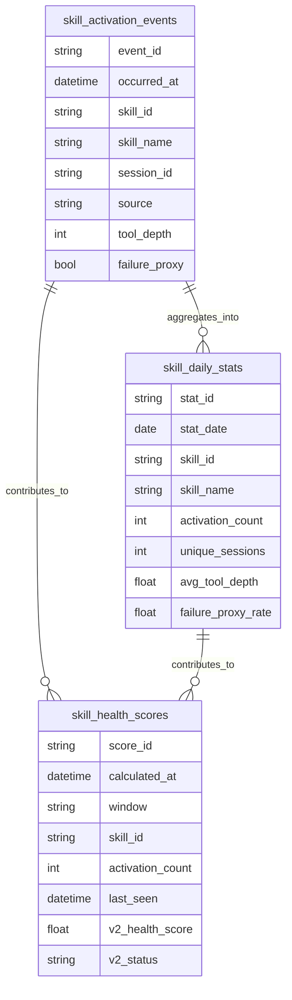

# Skill Health Dashboard Data Definitions

_Local data model, metric definitions, and scoring rules for Skill Health Dashboard._

---

## Purpose

This document defines the MVP data contract for Skill Health Dashboard. It explains what data is collected locally, how raw events become dashboard metrics, and how health statuses are calculated.

The MVP should keep the data model small, inspectable, and local-first. The statistical core should be based on the official `claude_code.skill_activated` event, with optional hook-derived context used only to enrich downstream behavior metrics.

## Data principles

- Store raw events locally before aggregation
- Keep derived metrics reproducible from raw events
- Prefer transparent rules over opaque scoring
- Avoid collecting content that is not needed for skill health analysis
- Treat health labels as review prompts, not automatic decisions
- Make every metric explainable in the dashboard

## Entity overview



## Table: `skill_activation_events`

The `skill_activation_events` table stores raw local observations. Each row represents one observed skill activation.

| Field | Type | Required | Description |
| --- | --- | --- | --- |
| `event_id` | text | Yes | Stable unique event identifier generated during ingestion |
| `occurred_at` | datetime | Yes | Timestamp when the skill activation occurred |
| `ingested_at` | datetime | Yes | Timestamp when the local collector stored the event |
| `skill_id` | text | Yes | Stable skill identifier when available; otherwise normalized skill name |
| `skill_name` | text | Yes | Human-readable skill name |
| `skill_version` | text | No | Optional skill version, file hash, or revision marker when available |
| `session_id` | text | No | Local session identifier if available |
| `source` | text | No | Event source, such as official event stream, plugin setup, sample data, or imported log |
| `activation_reason` | text | No | Short reason or trigger metadata if available without capturing sensitive content |
| `tool_depth` | integer | No | Count of downstream tool actions observed after activation |
| `failure_proxy` | boolean | No | Whether the activation appears to have weak or failed downstream value |
| `raw_event_ref` | text | No | Local pointer or hash for debugging without storing unnecessary raw payloads |

### Notes

- `event_id` should make ingestion idempotent.
- `skill_id` should remain stable across display name changes when possible.
- `activation_reason` should be optional and conservative because it can accidentally capture sensitive context.
- `raw_event_ref` should avoid storing large or sensitive payloads in the main table.

## Table: `skill_daily_stats`

The `skill_daily_stats` table stores aggregated per-skill daily metrics.

| Field | Type | Required | Description |
| --- | --- | --- | --- |
| `stat_id` | text | Yes | Stable unique identifier for the skill and date |
| `stat_date` | date | Yes | Normalized calendar date for the aggregation, derived from the aware `occurred_at` instant |
| `skill_id` | text | Yes | Skill identifier |
| `skill_name` | text | Yes | Skill name as of aggregation time |
| `activation_count` | integer | Yes | Number of activations on the date |
| `unique_sessions` | integer | Yes | Number of distinct sessions where the skill activated |
| `avg_tool_depth` | real | No | Average downstream tool depth for the date |
| `failure_proxy_count` | integer | Yes | Number of activations marked with `failure_proxy` |
| `failure_proxy_rate` | real | No | `failure_proxy_count / non_null_failure_proxy_count` when at least one non-null `failure_proxy` value is available; otherwise null |
| `first_seen_at` | datetime | No | First activation timestamp for the date |
| `last_seen_at` | datetime | No | Last activation timestamp for the date |
| `updated_at` | datetime | Yes | Timestamp when this aggregate was last calculated |

### Notes

- Aggregation should parse incoming timestamps as aware datetimes.
- Bucketing should use the normalized instant, not the raw local text form.
- `stat_date` should reflect the normalized aggregation bucket derived from that instant.

## Table: `skill_health_scores`

The `skill_health_scores` table stores calculated health summaries for a time window.

| Field | Type | Required | Description |
| --- | --- | --- | --- |
| `score_id` | text | Yes | Stable unique identifier for skill and scoring window |
| `calculated_at` | datetime | Yes | Timestamp when the score was calculated |
| `window` | text | Yes | Time window, such as `7d`, `30d`, or `90d` |
| `window_start` | datetime | Yes | Start of the scoring window |
| `window_end` | datetime | Yes | End of the scoring window |
| `skill_id` | text | Yes | Skill identifier |
| `skill_name` | text | Yes | Skill name as of scoring time |
| `activation_count` | integer | Yes | Total activations in the window |
| `unique_sessions` | integer | Yes | Distinct sessions in the window |
| `last_seen` | datetime | No | Most recent activation timestamp |
| `days_since_last_seen` | integer | No | Number of days between `window_end` and `last_seen` |
| `avg_tool_depth` | real | No | Average downstream tool depth in the window |
| `failure_proxy_rate` | real | No | Failure proxy rate in the window, or null when downstream/failure data are unavailable |
| `health_score` | integer | Yes | Legacy compatibility score |
| `status` | text | Yes | Legacy compatibility status |
| `security_score` | real | No | Safety score derived from risk-pattern signals |
| `clarity_score` | real | No | Description boundary clarity score |
| `overlap_score` | real | No | Similarity/redundancy score vs local skill set |
| `stability_score` | real | No | Cross-session consistency score |
| `efficiency_score` | real | No | Cost-efficiency score from depth/cost proxies |
| `confidence_score` | real | No | Evidence sufficiency score |
| `v2_health_score` | integer | No | V2 weighted score (0-100) |
| `v2_status` | text | No | `Qualified`, `Watch`, `Unqualified` |
| `v2_reasons` | json | No | Dimension-level explainers |
| `risk_flags` | json | No | Security/overlap/confidence risk markers |
| `diagnostic_reasons` | json | Yes | List of rule explanations used to derive the score |

## Metric definitions

### `activation_count`

`activation_count` is the number of observed `claude_code.skill_activated` events for a skill in a selected time window.

Rules:

- Count one row per unique `event_id`
- Exclude duplicate ingestions of the same event
- Include sample events only when the dashboard is explicitly using sample data mode

### `unique_sessions`

`unique_sessions` is the number of distinct local sessions in which a skill was activated.

Rules:

- Count unique non-empty `session_id` values
- If `session_id` is unavailable, this metric may be null or estimated from available local metadata
- Do not infer cross-user identity

### `last_seen`

`last_seen` is the most recent `occurred_at` timestamp for a skill.

Rules:

- Use event occurrence time, not ingestion time
- Display in the user's local timezone
- Use null or an empty state when a known skill has no activations
- Parse incoming timestamps as aware datetimes before comparison or display

### `avg_tool_depth`

`avg_tool_depth` estimates how much tool activity happened after a skill was activated.

Recommended MVP definition:

```text
avg_tool_depth = sum(tool_depth for activations in window) / activation_count_with_tool_depth
```

Rules:

- `tool_depth` should count downstream tool actions after activation within a bounded follow-up window
- The MVP follow-up window should default to the same session and a short time horizon
- If no downstream tool data is available, show the metric as unavailable rather than zero
- Zero means downstream tracking was available and no downstream tool activity was observed

### `failure_proxy_rate`

`failure_proxy_rate` estimates the share of activations that may have produced weak or unsuccessful downstream value.

Recommended MVP definition:

```text
failure_proxy_rate = failure_proxy_count / non_null_failure_proxy_count
```

Here `non_null_failure_proxy_count` is the number of activations in the window with a non-null `failure_proxy` value. If no non-null flags exist, `failure_proxy_rate` is null/unavailable. In that case, scoring should grant the neutral unavailable credit rather than treating the skill as low quality by default.

An activation may be marked as `failure_proxy = true` when one or more of these signals are present:

- No downstream tool activity was observed when tracking was available
- The session quickly switched away from the activated skill
- A relevant tool call failed soon after activation
- The activation was followed by repeated correction or retry behavior
- The user manually ignored the skill suggestion when such a signal is available

This is a proxy metric, not a true failure label. The dashboard should explain it as an approximation.

### `v2_health_score`

`v2_health_score` is a weighted, explainable score from six dimensions.

Recommended MVP scoring model:

| Component | Points | Description |
| --- | ---: | --- |
| Usage recency | 25 | Recent activation indicates the skill is still relevant |
| Usage frequency | 25 | Repeated activation indicates ongoing value |
| Session spread | 15 | Use across multiple sessions is stronger than one isolated use |
| Downstream activity | 20 | Tool activity after activation suggests practical utility |
| Low failure proxy | 15 | Lower failure proxy rate improves confidence |

The score should be recalculated for each time window. Rule explanations should be stored in `diagnostic_reasons`.

## Default scoring rules

### Usage recency: 25 points

| Condition | Points |
| --- | ---: |
| Seen within 7 days | 25 |
| Seen within 30 days | 15 |
| Seen within 90 days | 5 |
| Not seen within 90 days or never seen | 0 |

### Usage frequency: 25 points

| 30-day activation count | Points |
| --- | ---: |
| 10 or more | 25 |
| 3 to 9 | 15 |
| 1 to 2 | 5 |
| 0 | 0 |

### Session spread: 15 points

| 30-day unique sessions | Points |
| --- | ---: |
| 5 or more | 15 |
| 2 to 4 | 10 |
| 1 | 3 |
| 0 or unavailable | 0 |

### Downstream activity: 20 points

| Average tool depth | Points |
| --- | ---: |
| 3 or more | 20 |
| 1 to 2.99 | 10 |
| 0 | 0 |
| Unavailable | 8 |

Unavailable downstream data gets partial neutral credit so skills are not over-penalized before hook enrichment is configured.

### Low failure proxy: 15 points

| Failure proxy rate | Points |
| --- | ---: |
| 0% to 10% | 15 |
| More than 10% to 30% | 8 |
| More than 30% to 60% | 3 |
| More than 60% | 0 |
| Unavailable | 8 |

## Status classification

| Status | Rule |
| --- | --- |
| `Qualified` | High `v2_health_score`, adequate `confidence_score`, and no critical risk flags |
| `Watch` | Mid-range score or evidence is insufficient |
| `Unqualified` | Low score, or high-risk flags are present |

Severe diagnostic flags may override the numeric score. Examples include a very high failure proxy rate, repeated zero-depth activations, or strong overlap signals in a future similarity detection phase.

## Time windows

| Window | Purpose |
| --- | --- |
| `7d` | Recent activity and short-term regressions |
| `30d` | Default dashboard view and MVP scoring window |
| `90d` | Longer-term retention, retirement, and cleanup decisions |

The default dashboard window should be `30d`. The `90d` view should be used before recommending that a skill may be retired.

## Deduplication rules

The collector should deduplicate events before aggregation.

Recommended order:

1. Use `event_id` when provided or generated deterministically
2. If no event ID is available, derive a local hash from `occurred_at`, `skill_id`, `session_id`, and `source`
3. Treat exact repeated ingestions as one event
4. Preserve ingestion logs separately if debugging duplicate collection is needed

## Table: `skill_inventory`

The `skill_inventory` table stores installed local skills discovered by scanning local `SKILL.md` files.

| Field | Type | Required | Description |
| --- | --- | --- | --- |
| `skill_id` | text | Yes | Stable identifier for the installed skill |
| `skill_name` | text | Yes | Display name from frontmatter `name` or directory fallback |
| `description` | text | No | Description from frontmatter |
| `source` | text | Yes | Inventory source label, such as `local_skill_scan` |
| `path` | text | Yes | Absolute local path to `SKILL.md` |
| `modified_at` | datetime | No | Last observed file modified time |
| `scanned_at` | datetime | Yes | Timestamp when this row was refreshed by scanner |

## Known skill inventory behavior

Some skills may have zero activations but should still appear in the dashboard if they are installed locally.

MVP behavior:

- Keep activation events and skill inventory separate tables
- Aggregate and score using `skill_inventory` plus `skill_activation_events`
- Show installed-but-unused skills with `activation_count = 0` and `last_seen = null`
- Keep status rule-based and explicit for inactive skills

## Data retention

Recommended MVP defaults:

| Data type | Retention |
| --- | --- |
| Raw activation events | Keep until the user deletes local data |
| Daily aggregates | Rebuildable from raw events; safe to regenerate |
| Health scores | Recalculate as needed; keep recent snapshots for debugging |
| Sample data | Clearly separated from real local data |

The user should be able to delete local data without affecting skill files.

## Sample data requirements

Sample data should include:

- At least one clearly `Qualified` skill
- At least one `Watch` skill
- At least one `Unqualified` skill
- At least 30 days of synthetic activation history
- Examples with and without downstream tool depth
- No real user data

Sample data must be visibly labeled so users do not confuse it with real local activity.

## Open questions for implementation

- What exact local source exposes `claude_code.skill_activated` events in each supported environment?
- Which hook signals are available without collecting sensitive content?
- How should skill renames or moved skill files be matched over time?
- Should scoring thresholds be configurable in the first release or fixed until the model is validated?
