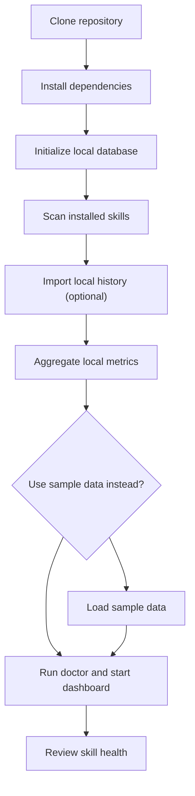

# Skill Health Dashboard Installation and Usage

_Local setup and first-use guide for the Skill Health Dashboard MVP._

---

## Purpose

This guide explains how a user should install, start, and use Skill Health Dashboard.

The project is designed as a local-first developer tool. It should run on the user's machine, store data locally, and avoid requiring a cloud account or remote backend.

## Expected user flow



## Requirements

The MVP should document exact supported versions when implementation begins. The expected baseline is:

| Requirement | Expected role |
| --- | --- |
| Git | Clone the open source repository |
| Local runtime | Run the collector, aggregation process, and dashboard |
| SQLite | Store local raw and aggregated data |
| Browser | View the local dashboard |
| Agent platform event/log access | Provide local events or local history files for importer/collector |

No cloud account should be required for the default local workflow.

## Installation

Install the project in editable mode:

```bash
python -m pip install -e .
```

## Initialize local storage

The dashboard should create a local database before importing events or showing real metrics.

Recommended command shape:

```bash
skill-health init
```

## One-command refresh (recommended)

```bash
skill-health refresh
```

This command runs:

- `skill-health scan skills`
- `skill-health import codex`
- `skill-health aggregate`
- `skill-health doctor`

Expected result:

- A local SQLite database is created
- Required tables are initialized
- No remote service is contacted
- The user sees the local database path

Example success message:

```text
Local database initialized:
~/.skill-health/skill-health.sqlite
```

## Scan installed skills

```bash
skill-health scan skills
```

Expected result:

- `SKILL.md` files under `~/.codex/skills`, `~/.codex/superpowers/skills`, and `~/.agents/skills` are scanned
- Skill inventory rows are upserted locally
- Installed skills appear in dashboard aggregates even when unused

## Import local history (optional)

```bash
skill-health import codex
```

Current built-in importer (`codex`) behavior:

- Reads local `~/.codex/sessions/**/*.jsonl` and `~/.codex/logs_2.sqlite`
- Uses local skill file load commands (`Get-Content ...\\SKILL.md` or `cat .../SKILL.md`) as activation proxy
- Stores only minimal metadata fields required for dashboard metrics

## Use sample data

Sample data is optional and should remain clearly separated from real local data.

Recommended command:

```bash
skill-health demo load
```

Expected result:

- Synthetic events are loaded into the local database
- The dashboard clearly labels the data as sample data, and the Overview page should make that state visibly obvious
- Sample data includes examples of all health statuses

Sample data should include:

- A frequently used `Healthy` skill
- A low-frequency `Needs Review` skill
- A long-unused `Candidate to Merge/Retire` skill
- At least 30 days of synthetic history
- Examples with and without downstream tool depth

## Real collection notes

Direct platform events (for example `claude_code.skill_activated`) remain preferred primary signals. Current importer behavior is an MVP proxy.

When that work lands, the collection layer should distinguish between:

| Source | Purpose |
| --- | --- |
| `claude_code.skill_activated` | Planned primary skill activation signal |
| Optional plugin setup | Planned installation and collection onboarding |
| Optional hooks | Planned downstream toolchain behavior after skill activation |
| Imported logs | Optional local history imports from supported platforms (current: `skill-health import codex`) |
| Sample data | Synthetic demo events only |

## Start the dashboard

The dashboard should run locally and open in the user's browser.

Recommended command:

```bash
skill-health dashboard
```

Expected result:

```text
Skill Health Dashboard is running locally:
http://localhost:3000
```

The dashboard rebuilds aggregates before serving, so `skill-health demo load` followed directly by `skill-health dashboard` also works.

## Doctor diagnostics

Run local diagnostics for issue reports:

```bash
skill-health doctor
```

Typical output includes database path, installed skills found, detected session files, imported activations, sample-data state, last aggregate, and dashboard readiness.

## Terminal summary output

If you want results directly in the terminal (or chat copy/paste), run:

```bash
skill-health summary
```

This prints installed skill count, scored skill count, six-dimension averages, status breakdown, and top skills in plain text.

The dashboard should remain useful without internet access after local setup.

## Read the Overview page

The Overview page should be the first screen users see.

Users should look for:

| Area | What it tells the user |
| --- | --- |
| Total skills | How many skills are represented in the current sample dataset |
| Status cards | How many skills fall into each current status bucket |
| Review candidates | How many skills may need cleanup |
| Top skills | Which skills are used most often |
| Sample data banner | Whether the dashboard is showing demo data instead of local usage |

Default window: 30 days.

Skill Table and Skill Detail are not part of this vertical slice yet. The runnable MVP stops at the Overview page and `/api/overview`.

## Recommended cleanup workflow

Users can use the dashboard to maintain their skill pool:

1. Review `Candidate to Merge/Retire` skills first
2. Check whether a skill has been unused for 90 days
3. Inspect whether the skill overlaps with another active skill
4. Decide whether to keep, merge, split, rewrite, or retire it
5. Make changes manually in the user's skill files
6. Revisit the dashboard after a few days of usage

## Empty states

### No database

Message:

```text
No local database found. Initialize local storage to begin.
```

Suggested action:

```bash
skill-health init
```

### No events

Message:

```text
No skill activation events have been collected yet.
```

Suggested actions:

- Run `skill-health scan skills`
- Run `skill-health import codex`
- Or load sample data

### Sample data mode

Message:

```text
You are viewing sample data. These metrics do not represent your local skill usage, and the sample-data banner should be visible on every dashboard page.
```

Suggested action:

Delete the local database file from the configured local path, then rerun `skill-health init` and load sample data again if needed.

## Troubleshooting

| Problem | Likely cause | Suggested action |
| --- | --- | --- |
| Dashboard opens but shows no data | Database is empty | Load sample data or reinitialize local storage |
| Status cards look sparse | Sample data has limited records | Reload the bundled demo dataset |
| `avg_tool_depth` is unavailable | Hook enrichment is not configured | Continue with activation metrics or configure hooks |
| Status seems too harsh | Downstream data is missing or scoring thresholds need tuning | Inspect diagnostic reasons before changing skills |
| Dashboard cannot start | Port conflict or missing dependencies | Use a different port or rerun installation |

## Local files

The implementation should document exact paths. Recommended default locations:

| File | Purpose |
| --- | --- |
| `~/.skill-health/skill-health.sqlite` | Local SQLite database |
| `~/.skill-health/config.toml` | Local configuration |
| `~/.skill-health/logs/` | Local logs |
| `~/.skill-health/exports/` | Optional local report exports |

All paths should be configurable for users who prefer a project-local setup.

## Configuration

The MVP configuration should stay small.

Recommended configuration fields:

| Field | Purpose |
| --- | --- |
| `database_path` | Local SQLite database path |
| `event_source` | Primary local event source |
| `enable_hooks` | Whether hook-derived downstream behavior is collected |
| `default_window` | Default dashboard time window |
| `sample_data_enabled` | Whether sample data mode is active |

Example shape:

```toml
database_path = "~/.skill-health/skill-health.sqlite"
event_source = "claude_code.skill_activated"
enable_hooks = false
default_window = "30d"
sample_data_enabled = false
```

## Uninstall and data deletion

The user should be able to remove local data without affecting their skills.

Delete the local Skill Health database and any related logs manually from the configured local paths shown above. Do not delete user skill files, agent configuration unrelated to Skill Health Dashboard, or any remote repositories.

## Release readiness checklist

- [ ] Installation command is concrete and tested
- [ ] Dashboard start command is concrete and tested
- [ ] Sample data can be loaded and cleared
- [ ] Local database path is shown to the user
- [ ] Future collection scope is documented separately
- [ ] Empty states are documented
- [ ] Troubleshooting table covers common first-run issues
- [ ] Uninstall and data deletion behavior is documented
